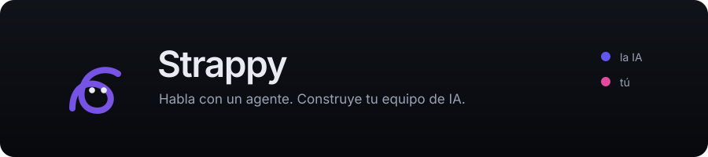
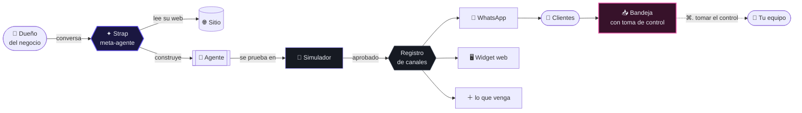

<div align="center">



<br><br>

**Habla con un agente. Construye tu equipo de IA.**

Plataforma para crear, probar y operar agentes de inteligencia artificial conversando<br>
con uno. Sin formularios, sin código, sin curva de aprendizaje.

<br>

[](#-hoja-de-ruta)
[](#-licencia)
[](#)

<br>

[](https://nextjs.org)
[](https://react.dev)
[](https://www.typescriptlang.org)
[](https://tailwindcss.com)
[](https://supabase.com)
[](https://www.postgresql.org)
[](https://sdk.vercel.ai)
[](https://developers.facebook.com/docs/whatsapp)
[](https://pnpm.io)

<br>

[Qué es](#-qué-es) · [Cómo funciona](#-cómo-funciona) · [Arquitectura](#-arquitectura) · [Stack](#-stack) · [Empezar](#-empezar) · [Hoja de ruta](#-hoja-de-ruta)

</div>

<br>

---

## ✦ Qué es

La mayoría de las plataformas de agentes te dan un formulario con veinte campos y te desean suerte. Strappy te da **una conversación**.

Le cuentas a qué se dedica tu negocio. Él lee tu sitio web, te hace tres preguntas, construye el agente, te enseña exactamente qué configuró y **te deja probarlo ahí mismo** — antes de conectar nada. Cuando funciona, lo enchufas a tu WhatsApp.

> **La pantalla de inicio no es un panel de control vacío. Es un cursor parpadeando.**

Y cuando el agente ya está atendiendo, la bandeja responde de un vistazo la pregunta que te vas a hacer cien veces al día: *¿esto lo contestó el robot o lo contesté yo?*

<br>

<table>
<tr>
<td width="50%" valign="top">

### 🤖 Para tus clientes

Agentes que atienden WhatsApp 24/7. Califican, agendan, responden con la información real de tu negocio y saben cuándo callarse y pasarte el turno.

</td>
<td width="50%" valign="top">

### 🛠️ Para tu empresa

Agentes que trabajan *para ti*. Le pides por chat que actualice los precios de tu web o que pause las campañas que pierden dinero, y lo hace — con evidencia y botón de deshacer.

</td>
</tr>
</table>

<br>

## ✧ La idea que lo organiza todo

**El color codifica quién habla.** No es decoración: es la única señal que necesitas para leer una conversación de un vistazo.

<div align="center">

| | Actor | Dónde lo ves |
|:--:|:--|:--|
| 🟣 **Índigo** | La IA | Burbujas del agente, el orbe del inicio, acciones primarias |
| 🩷 **Fucsia** | Tú y tu equipo | Burbujas humanas, la barra «Tienes el control», notas internas |
| ⬜ **Neutro alto** | El cliente | Mensajes entrantes |
| ▫️ **Neutro medio** | El sistema | Eventos, separadores, auditoría |

</div>

Esa dualidad se propaga a las burbujas, a la bandeja, a los gráficos y hasta a la mascota. Es la firma del producto.

<br>

## ▸ Cómo funciona



**El truco está en el orden:** el agente se prueba en el simulador *antes* de conectar ningún canal. El tiempo desde que abres la app hasta que ves tu agente funcionando es de **menos de cinco minutos**, y no depende de que ningún tercero apruebe nada.

<br>

## ⚡ Lo que trae

<table>
<tr><td width="33%" valign="top">

#### ✦ Meta-agente
Construye agentes conversando. Lee tu web, propone, confirma con una lista de verificación y te reporta qué configuró. Su borrador **se guarda paso a paso**: cierras el navegador y retoma donde ibas.

</td><td width="33%" valign="top">

#### 🧪 Simulador
No es una maqueta: es *el mismo motor* con otro transporte. Incluso puede **jugar él solo el papel del cliente** y enseñarte la conversación completa con los datos que extrajo.

</td><td width="33%" valign="top">

#### 📥 Bandeja
Toma el control con `⌘.`, notas internas, respuestas rápidas con `/`, etiquetas, asignación, posponer y SLA. Con la garantía de que **el bot nunca escribe encima de ti**.

</td></tr>
<tr><td valign="top">

#### 🧠 Cerebros
Sube tu catálogo, tus precios, tu web. Búsqueda híbrida (vectorial + léxica en español) para que acierte con nombres de producto. Con un botón «Pruébalo» que te enseña qué fragmentos usó.

</td><td valign="top">

#### ⚡ Lite y Max
Dos modos de modelo. **Lite** para el día a día, **Max** para lo difícil. Con una diferencia de coste de ~60× que tú controlas.

</td><td valign="top">

#### 📊 Créditos claros
Un medidor honesto, con proyección de fin de mes. Y separa lo que te cobramos nosotros de lo que **Meta te cobra a ti directamente**.

</td></tr>
</table>

<br>

## 🧱 Arquitectura

### La regla que sostiene todo

> **El motor no conoce WhatsApp.**
>
> No sabe qué es una ventana de 24 horas, ni una plantilla aprobada, ni un `phone_number_id`. Le pregunta al canal `canSend()` y el canal responde con una restricción ya redactada.

Suena a detalle, pero es la diferencia entre añadir un canal nuevo en un día o reescribir el producto. Tres cosas se declaran en **tablas, no en código**:

<div align="center">

| Registro | Qué declara | Hoy | Mañana |
|:--|:--|:--|:--|
| **Canales** | Cómo entra y sale un mensaje, y sus reglas propias | `whatsapp` · `simulador` | widget web · Instagram · correo · voz |
| **Tipos de agente** | Qué puede ser un agente y qué runtime lo ejecuta | `conversacional` · `tarea` | `voz` · `programado` |
| **Capacidades** | Qué sabe construir el meta-agente | agente de texto | agente de voz · conectar canal · contratar |

</div>

Y hay un test que lo protege: **al añadir WhatsApp, el diff sobre el núcleo debe salir vacío**. Si el motor tuvo que aprender qué es una ventana de 24 horas, la abstracción falló.

### El reparto

```
     ┌──────────────────────────────────────────────────────────┐
     │  Vercel · lo que es petición → respuesta                  │
     │  ─────────────────────────────────────────────────────    │
     │  Panel · Chat del meta-agente · Webhook (delgado, <200ms) │
     └───────────────────────────┬──────────────────────────────┘
                                 │  pgmq
     ┌───────────────────────────▼──────────────────────────────┐
     │  Worker persistente · lo que es diferido, largo o con     │
     │  estado                                                   │
     │  ─────────────────────────────────────────────────────    │
     │  Motor · Ingesta · Media · Envío · RAG · Tareas · Voz     │
     └───────────────────────────┬──────────────────────────────┘
                                 │
     ┌───────────────────────────▼──────────────────────────────┐
     │  Postgres · Auth · RLS · Realtime · pgvector · pgmq       │
     └──────────────────────────────────────────────────────────┘
```

### Tres decisiones que vale la pena explicar

<details>
<summary><b>Por qué el motor responde una sola vez a tres mensajes seguidos</b></summary>

<br>

Cuando alguien te escribe «hola», «quiero info», «del plan pro» en tres segundos, un bot ingenuo contesta tres veces y queda ridículo.

Cada mensaje **reprograma** la ejecución. Cuando un trabajo despierta y ve que se reprogramó después, se descarta sin hacer nada. Solo el último sobrevive, y ve los tres mensajes juntos.

Además hay un **lock por conversación** con doble barrera —un lock consultivo transaccional más un lease persistente por si el proceso muere— para que ni con diez réplicas del worker se solapen dos respuestas.

</details>

<details>
<summary><b>Por qué el bot nunca escribe encima de un humano</b></summary>

<br>

El modelo tarda un par de segundos en responder. En esos dos segundos, un agente humano puede haber tomado el control de la conversación.

Por eso, después de generar la respuesta y **antes** de encolar el envío, el motor vuelve a leer el estado de control dentro del lock. Si alguien tomó el control, la respuesta se descarta y queda registrada como `taken_over`.

Sin ese detalle, el bug «el bot contestó encima del asesor» es inevitable. Con él, imposible.

</details>

<details>
<summary><b>Por qué no cobramos tus mensajes de WhatsApp</b></summary>

<br>

Operamos como **Tech Provider** de Meta: tu cuenta de WhatsApp y tu número son **tuyos**, y tu método de pago está en tu Meta Business Manager. Meta te cobra a ti, directo.

Nosotros solo cobramos el software. Si algún día te vas, te llevas tu número, tus plantillas aprobadas y tu calificación de calidad.

Por eso el panel de analíticas tiene dos bloques que nunca se mezclan: *tu gasto en Meta* y *tu consumo en Strappy*.

</details>

<br>

## 🧰 Stack

### Núcleo

| Tecnología | Versión | Por qué esta y no otra |
|:--|:--|:--|
| **Next.js** | 16.3 · App Router | Server Components para las tablas y el panel; streaming real en Node para el chat |
| **React** | 19.2 | Acciones de servidor y transiciones para la bandeja en vivo |
| **TypeScript** | 5.9 · estricto | Con `noUncheckedIndexedAccess`: los accesos a arrays no mienten |
| **Tailwind CSS** | v4 · `@theme` | Compila los tokens como variables CSS nativas: cambiar de tema no recompila |
| **pnpm** | 11 · workspaces | Monorepo sin la ceremonia de una herramienta de build extra |

### Datos y ejecución

| Tecnología | Papel | Detalle |
|:--|:--|:--|
| **Supabase** | Auth · RLS · Realtime · Storage | Una sola pieza cubre identidad, aislamiento entre clientes y tiempo real |
| **PostgreSQL** | Base de datos | Sin ORM: SQL a mano, porque el aislamiento por filas es más predecible así |
| **pgvector** | Búsqueda semántica | Índice HNSW + GIN en español, fusionados con *reciprocal rank fusion* |
| **pgmq** | Cola de trabajos | Transaccional con los datos, con reintentos y cola de fallos. Cero infraestructura nueva |

### Inteligencia

| Tecnología | Papel | Detalle |
|:--|:--|:--|
| **AI SDK v6** | Capa de modelos | Herramientas tipadas y, lo decisivo, **consumo normalizado por paso** — sin eso el sistema de créditos no existe |
| **AI Gateway** | Cartera de modelos | Una factura, un saldo, respaldo automático entre proveedores |
| **Zod** | Contratos | Un solo esquema sirve al modelo, a la API y al formulario |

### Interfaz

| Tecnología | Papel |
|:--|:--|
| **Radix UI** | Comportamiento accesible de verdad: foco atrapado, ARIA, colisiones de popover |
| **Geist Sans / Mono** | Cifras tabulares nativas — una tabla de teléfonos y créditos se lee alineada |
| **Lucide** | Iconos de trazo, a juego con la mascota |
| **TanStack Table** | Tablas sin estilos propios: columnas configurables y orden del lado del servidor |
| **CodeMirror 6** | Editor del prompt. Markdown plano, porque un editor visual lo convierte en árbol y arruina el diff |
| **Recharts** | Gráficas que aceptan los colores desde las variables CSS del tema |

### La cartera de modelos

<div align="center">

| Modo | Modelos | $/M entrada | $/M salida | Contexto |
|:--|:--|--:|--:|--:|
| ⚡ **Lite** | `zai/glm-4.7-flash` | 0,07 | 0,40 | 200k |
| | `deepseek/deepseek-v4-flash` | 0,13 | 0,26 | 1M |
| ✨ **Max** | `anthropic/claude-sonnet-5` | 2,00 | 10,00 | 1M |
| | `anthropic/claude-opus-5` | 5,00 | 25,00 | 1M |

</div>

Los modos son **filas en una tabla**, no constantes: cambiar de modelo es un `UPDATE`, no un despliegue.

<br>

## 📁 Estructura

```
strappy/
│
├── apps/
│   ├── web/                    Next.js · panel, chat del meta-agente, webhooks
│   └── worker/                 Node persistente · motor, colas, tareas largas
│
├── packages/
│   ├── core/                   ◆ el corazón
│   │   ├── registry/           los tres registros extensibles
│   │   ├── prompt/             compilador determinista de 7 capas
│   │   ├── engine/             motor: debounce, locks, anti-colisión
│   │   ├── channels/           adaptador del simulador
│   │   └── credits/            contabilidad de consumo
│   ├── tools/                  registro ÚNICO de herramientas (AI SDK + MCP)
│   ├── whatsapp/               adaptador de canal · cliente Graph tipado
│   ├── rag/                    ingesta, troceado, embeddings, recuperación
│   ├── db/                     migraciones SQL, RLS, tipos
│   └── ui/                     sistema de diseño
│
└── assets/                     logotipo y mascota
```

<br>

## 🚀 Empezar

### Requisitos

```
Node.js  ≥ 22        pnpm  ≥ 11        Docker (para Supabase local)
```

### Instalación

```bash
git clone https://github.com/AltotraficoCO/ai-agency.git
cd ai-agency
pnpm install
```

### Configuración

```bash
cp .env.example .env.local
```

<details>
<summary><b>Variables de entorno</b></summary>

<br>

| Variable | Para qué | Obligatoria |
|:--|:--|:--:|
| `NEXT_PUBLIC_SUPABASE_URL` | Proyecto de Supabase | ✅ |
| `NEXT_PUBLIC_SUPABASE_ANON_KEY` | Clave pública | ✅ |
| `SUPABASE_SERVICE_ROLE_KEY` | Solo servidor. **Nunca** en el cliente | ✅ |
| `AI_GATEWAY_API_KEY` | Cartera de modelos | ✅ |
| `ENCRYPTION_KEY` | AES-256-GCM para credenciales de terceros | ✅ |
| `META_APP_ID` · `META_APP_SECRET` | App de Meta para el alta de clientes | — |
| `META_WEBHOOK_VERIFY_TOKEN` | Verificación del webhook | — |
| `STRIPE_SECRET_KEY` · `STRIPE_WEBHOOK_SECRET` | Suscripciones y recargas | — |

> ⚠️ Este repositorio es **público**. Ninguna clave debe llegar al árbol de trabajo: todas por variables de entorno. El `.gitignore` bloquea los `.env`, pero la disciplina es tuya.

</details>

### Base de datos

```bash
supabase start                              # Postgres local con las extensiones
pnpm --filter @strappy/db migrate            # aplica las migraciones
pnpm --filter @strappy/db test:isolation     # ⚠️ debe pasar SIEMPRE
```

> El test de aislamiento crea dos espacios de trabajo y comprueba que ninguno ve datos del otro. **Es el único test que bloquea cualquier avance, sin excepción.**

### Levantar

```bash
pnpm dev                # panel en http://localhost:3000
pnpm --filter @strappy/worker dev
```

### Comprobaciones

```bash
pnpm typecheck          # tipos en todo el monorepo
pnpm lint
pnpm test
pnpm build
```

<br>

## 🧭 Hoja de ruta

<div align="center">

| | Fase | Criterio de aceptación |
|:--:|:--|:--|
| 🟢 | **Cimientos** | Dos clientes, y ninguno ve nada del otro |
| 🟡 | **Sistema de diseño** | Cada componente con sus cinco estados |
| 🟡 | **Motor + simulador** | Un agente conversa **sin una línea de WhatsApp en el motor** |
| ⚪ | **Meta-agente** | Alguien no técnico crea y prueba un agente en **< 5 min** |
| ⚪ | **Cerebros** | Responde precios reales de un PDF que subiste |
| ⚪ | **Canal WhatsApp** | Mensaje real de punta a punta — **y el motor no cambió** |
| ⚪ | **Bandeja** | Tomas el control y el bot no escribe encima |
| ⚪ | **Créditos** | Respondes «¿cuánto pago este mes?» de un vistazo |
| ⚪ | **Análisis** | Un lead entra, se califica, y te llega la alerta con sus datos |
| ⚪ | **Evaluación** | No se puede publicar un agente que caiga en una inyección |
| ⚪ | **Agentes por encargo** | Le pides un cambio en tu web y lo hace, con botón de deshacer |
| ⚪ | **Segundo canal + voz** | Añadir el widget no toca el motor ni la bandeja |

</div>

Cada fase se cierra con su criterio cumplido. No con «ya está casi».

<br>

## 🔐 Seguridad

El riesgo número uno de un agente conectado a WhatsApp es evidente: **cualquiera con el número puede escribirle**. Las defensas:

- El mensaje de un cliente **nunca** se concatena al prompt del sistema.
- El contenido recuperado de la web o de documentos va delimitado como **datos, jamás instrucciones**.
- Superficie mínima de herramientas, declarada por agente. Ninguna herramienta acepta el identificador del cliente como parámetro del modelo.
- Filtro de salida que bloquea credenciales, tokens y el propio prompt.
- **Antes de publicar**, cinco conversaciones sintéticas —una de ellas de inyección— y si falla, **se bloquea la publicación**.

¿Encontraste algo? Escribe a **atencion@altotrafico.co** en vez de abrir un issue público.

<br>

## 📄 Licencia

Software propietario de **Altotráfico**. Todos los derechos reservados.

<br>

---

<div align="center">


<br>

**Hecho en Colombia** 🇨🇴

<sub>Si tu agente contesta mejor que tú un domingo a las 11 de la noche, funcionó.</sub>

</div>
