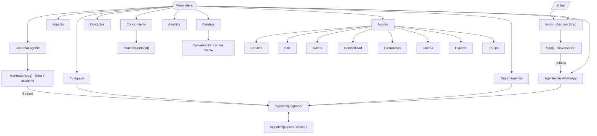

# Mapa de la aplicación

Fecha: 12 de septiembre de 2026.
Para quien va a **rediseñar la aplicación sin poder ver el código**.

Todo lo que hay aquí está verificado contra el código: las rutas son las reales,
los nombres son los que lee el cliente y las acciones son las que existen hoy.
Lo que no pude confirmar está al final, en «Dudas».

---

## 1. Qué es Strappy

Una **agencia de inteligencia artificial**. El dueño de un negocio entra y
contrata agentes como contrataría empleados: un Webmaster que le mantiene la
web, un agente de Marketing que le lleva los anuncios, uno financiero que
persigue los cobros. No se paga por agente: **se paga por créditos**, y solo se
gastan cuando el agente trabaja.

Hay dos familias de agentes, y se comportan distinto:

- **Los de WhatsApp** (Comunicaciones) hablan con los clientes del negocio. No
  se contratan: **los crea la persona conversando con Strap**, el meta-agente.
- **Los del negocio** (Marketing, Creativo, Desarrollo, Financiero) trabajan
  **por encargo**: se les pide algo, lo hacen en segundo plano y se ve el
  registro de su trabajo en vivo.

---

## 2. Inventario de pantallas

### Fuera de la sesión

| Ruta | Nombre | Para qué |
|---|---|---|
| `/entrar` | Entrar | Iniciar sesión |
| `/registro` | Crear cuenta | Alta nueva |
| `/recuperar` | Recuperar contraseña | Pedir enlace de recuperación |
| `/actualizar-clave` | Contraseña nueva | Fijar contraseña tras recuperar |

### La aplicación

| Ruta | Nombre | Para qué | Departamento |
|---|---|---|---|
| `/` | Inicio | El chat con Strap: aquí se crean los agentes de WhatsApp | — (empresa) |
| `/c/[id]` | (título del hilo) | Una conversación con Strap, con su historial al lado | — |
| `/agentes` | Tu equipo | Todos los agentes del negocio, agrupados por departamento | — (empresa) |
| `/negocio/impacto` | Impacto | Cuánto dinero han ahorrado los agentes | — (empresa) |
| `/whatsapp/agentes` | Agentes de WhatsApp | Los que atienden clientes | Comunicaciones |
| `/bandeja` | Bandeja | Las conversaciones con clientes reales | Comunicaciones |
| `/contactos` | Contactos | Las personas que han escrito | Comunicaciones |
| `/conocimiento` | Conocimiento | Lo que los agentes saben del negocio | Comunicaciones |
| `/conocimiento/[id]` | (nombre de la base) | Una base: sus fuentes y quién la usa | Comunicaciones |
| `/analitica` | Analítica | Conversaciones, rendimiento y consumo | Comunicaciones |
| `/departamento/marketing` | Marketing | Agentes de ese departamento | Marketing |
| `/departamento/creativo` | Creativo | Ídem | Creativo |
| `/departamento/desarrollo` | Desarrollo | Ídem | Desarrollo |
| `/departamento/financiero` | Financiero | Ídem | Financiero |
| `/contratar` | Contratar agente | El catálogo, departamento por departamento | — |
| `/contratar/[slug]` | (nombre del agente) | Su ficha y el asistente de 4 pasos | — |
| `/agentes/[id]/probar` | Probar el agente | **La pantalla de trabajo**: encargos o simulador | — |
| `/agentes/[id]/instrucciones` | (nombre del agente) | Editar su ficha y sus instrucciones | — |
| `/agentes/[id]` | — | Redirige a `/instrucciones` | — |

### Ajustes (ocho secciones con navegación propia)

| Ruta | Nombre | Para qué |
|---|---|---|
| `/ajustes` | — | Redirige a `/ajustes/cuenta` |
| `/ajustes/cuenta` | Cuenta | Tu perfil y tu sesión |
| `/ajustes/espacio` | Espacio | Nombre, zona horaria y horario de atención |
| `/ajustes/equipo` | Equipo | Quién entra y qué puede hacer |
| `/ajustes/canales` | Canales | Conectar el número de WhatsApp |
| `/ajustes/sitio` | Sitio web | Conectar el WordPress del Webmaster |
| `/ajustes/avisos` | Avisos | A qué número avisa el Webmaster |
| `/ajustes/contabilidad` | Contabilidad | Conectar el sistema de facturación |
| `/ajustes/facturacion` | Facturación | Plan, consumo y pagos |

### Otras

| Ruta | Qué es |
|---|---|
| `/canales` | Ruta antigua: redirige a `/ajustes/canales` |
| `/muestrario` | Catálogo interno de componentes. No es del producto |

---

## 3. El mapa de navegación

### El menú lateral, en orden

```
Inicio
Tu equipo
Impacto
─────────────────────────
Comunicaciones  ▸  Agentes de WhatsApp · Bandeja (contador) · Contactos ·
                   Conocimiento · Analítica
Marketing       →  Agentes de marketing
Creativo        →  Agentes creativos
Desarrollo      →  Agentes de desarrollo
Financiero      →  Agentes financieros
─────────────────────────
[ Contratar agente ]   ← botón destacado
Créditos: 14 K / 50 K  ← se renueva el día X
Ajustes · (tema claro/oscuro)
Tu nombre y correo
```

Tres reglas del menú que conviene respetar:

1. **Arriba va lo de la empresa entera** —Inicio, Tu equipo, Impacto—, porque
   miran a todos los agentes. Impacto no cuelga de un departamento a propósito:
   metido en uno, parecería que solo mide ese.
2. **Un departamento con una sola pantalla se pinta como enlace directo**, no
   como desplegable. Un acordeón de un solo hijo son dos clics para lo mismo.
   En cuanto tenga dos pantallas, se convierte en desplegable solo.
3. **Comunicaciones no tiene pantalla de departamento** (`/departamento/comunicaciones`
   es un 404): sus agentes viven en `/whatsapp/agentes`, que ya existía y tiene
   bandeja, contactos y conocimiento alrededor.

### Diagrama



### Caminos que no pasan por el menú

- **Desde una tarjeta de agente** (en Tu equipo, en un departamento o en Agentes
  de WhatsApp) se abre su pantalla de trabajo. Cada tarjeta tiene además un menú
  de tres puntos con: Abrir, Probar e Instrucciones.
- **Desde el catálogo** se entra a la ficha de un agente, y desde la ficha al
  asistente de contratación, que acaba llevando a probarlo.
- **Desde la pantalla de un agente** se llega a lo que le falta conectar (por
  ejemplo, «Conectar mi sitio web» lleva a `/ajustes/sitio`).
- **Desde el widget de créditos** del menú se va a Facturación.
- **Desde Inicio**, los cuatro atajos abren una conversación con Strap ya
  empezada con esa intención.

---

## 4. Los recorridos, paso a paso

### 4.1. Entrar por primera vez

1. `/entrar` — formulario de correo y contraseña. Enlaces a crear cuenta y a
   recuperar.
2. Al entrar, se llega a **Inicio**.
3. Inicio **no es un panel**: es Strap (un personaje redondo) preguntando
   «Hola {nombre}, ¿qué construimos hoy?», un campo de texto grande y cuatro
   tarjetas de atajo para quien no sabe por dónde empezar.

### 4.2. Crear un agente de WhatsApp con Strap

1. En **Inicio**, se escribe qué se necesita («quiero un agente que atienda
   pedidos por WhatsApp») o se pulsa un atajo.
2. Se crea la conversación **antes** del primer mensaje y se navega a `/c/[id]`.
   Cerrar la pestaña a mitad no pierde nada: la conversación y el borrador del
   agente son la misma cosa.
3. En `/c/[id]`: a la izquierda el historial de conversaciones con Strap, a la
   derecha el hilo. La barra superior muestra **en qué fase va**:
   `Entendiendo qué necesitas` → `Conociendo tu empresa` → `Definiendo el agente`
   → `Confirmando antes de construir` → `Construyendo` → `Contándote qué quedó`
   → `Probando el agente` → `Listo`.
4. Strap pregunta de a poco (nombre del negocio, a qué se dedica, tono, qué
   datos recoger) y puede leer el sitio web si se le da.
5. Al publicar, el agente aparece en **Agentes de WhatsApp**.

### 4.3. Contratar un agente del catálogo

1. **Contratar agente** (`/contratar`). Arriba: «X de Y puestos cubiertos» y los
   tres pasos de cómo funciona. Debajo, **los departamentos hacia abajo**, y en
   cada uno una **fila ancha por agente**: cara, nombre, gancho, tres cosas que
   hace, chips de «necesita conectado», y los botones **Contratar** y **Ver ficha**.
2. **Ver ficha** (`/contratar/[slug]`): a la izquierda el personaje en grande,
   qué hace **con su detalle** y qué necesita conectado; a la derecha el
   asistente.
3. El asistente tiene **cuatro pasos**, con «Paso 2 de 4» y los nombres enteros:
   - **Elegir** — confirmar qué hace y qué cuesta.
   - **Conectar** — lo que le falta al espacio (lleva a la pantalla de Ajustes
     que toque).
   - **Personalizar** — de tres a cinco preguntas que **cambian su
     comportamiento** (por ejemplo, al financiero: desde cuántos días perseguir
     una factura, si puede emitir o solo preparar). Si un agente no necesita
     ajustes, lo dice en vez de enseñar un formulario vacío.
   - **Probar** — el agente se crea **en borrador** y el botón lleva al
     simulador. Publicar sin probar es lo que hace que un agente mal
     configurado le conteste a un cliente real.

### 4.4. Encargar un trabajo y seguirlo en vivo

1. Desde **Tu equipo** o desde su departamento se abre el agente:
   `/agentes/[id]/probar`.
2. La pantalla **parece un chat, pero cada mensaje es un encargo**. A la
   izquierda, el historial de encargos; a la derecha, la conversación.
3. Se escribe el encargo y se envía. Mientras trabaja: **su foto late**, la
   cabecera dice «Trabajando en tu web…» y el **registro de trabajo va sumando
   pasos en vivo** («Revisando el estado del sitio», «Diseñando una entrada con
   Elementor»). La pantalla se refresca sola cada cinco segundos.
4. Al terminar, queda el resumen, las capturas y lo que gastó en créditos.
5. Si el agente no tiene lo que necesita conectado, la pantalla lo dice arriba y
   ofrece el enlace para conectarlo.

### 4.5. Aprobar o rechazar lo que pide un agente

1. Cuando el agente necesita permiso, en la conversación aparece una tarjeta
   **distinta del resto**: borde de color, icono y un título que dice que espera
   por ti.
2. La tarjeta explica **qué va a hacer y cuánto cuesta en pesos**, no en
   porcentajes ni en siglas.
3. Dos botones: aprobar o rechazar. Al aprobar, el agente sigue desde donde se
   quedó. Al rechazar, lo cuenta y termina.
4. Hay un caso hermano: **preguntas**. El agente pide elegir entre opciones o
   escribir un dato, y se contesta en la misma tarjeta.

### 4.6. Conectar lo que necesitan los agentes

Todo vive en **Ajustes**, cada cosa en su sección:

- **WhatsApp** (`/ajustes/canales`): una tarjeta grande por canal con su estado.
  Conectar abre **una ventana de Meta**, y se avisa antes para que no parezca
  que la aplicación se fue a otra web.
- **Sitio web** (`/ajustes/sitio`): se pega la dirección del WordPress y una
  contraseña de aplicación.
- **Avisos** (`/ajustes/avisos`): a qué número escribe el Webmaster cuando algo
  se rompe. Exige una plantilla aprobada por Meta y lo explica con el texto
  listo para copiar. Sin plantilla, no se puede activar.
- **Contabilidad** (`/ajustes/contabilidad`): correo y token del sistema de
  facturación. **Se comprueba al guardar** si sirven y si permiten emitir o solo
  leer, y hay una casilla de «solo mirar».

### 4.7. Dar conocimiento y probarlo

1. **Conocimiento** (`/conocimiento`): lista de bases. Aquí **no se crean
   agentes**, se crean bases de conocimiento.
2. Se crea una base y se entra (`/conocimiento/[id]`).
3. Se le añaden fuentes de tres maneras: **un sitio web**, **archivos** o
   **texto pegado**.
4. Cada fuente pasa por estados: pendiente → aprendiendo → lista; o «revisar» /
   «error» con su explicación. Las que fallan por el proveedor se reintentan
   solas.
5. Hay un **«Pruébalo»**: se escribe una pregunta y se ve qué encontraría el
   agente.
6. Por último se **conecta la base a los agentes** que deban usarla.

### 4.8. Atender una conversación en la Bandeja

1. **Bandeja** (`/bandeja`). Pestañas: **Todas**, **Mías**, **Sin asignar**,
   **Sin leer**. Filtros por estado (abiertas, pospuestas, cerradas), canal,
   persona asignada, agente, etiqueta y fechas.
2. Se abre una conversación y se lee el hilo con el cliente.
3. Acciones disponibles: **tomar el control**, devolverlo, pausar la IA, pedir
   el control, asignar a alguien, posponer, cerrar, reabrir, marcar como leída,
   etiquetar, dejar una **nota interna** (no la ve el cliente), pedir un resumen
   y usar una respuesta sugerida.
4. La pantalla se mantiene sola: en vivo si la instalación lo permite, y
   sondeando si no —y lo dice.

### 4.9. Mirar Impacto y Analítica

- **Impacto** (`/negocio/impacto`): arriba la respuesta —cuánto dinero se ha
  ahorrado—, debajo de dónde sale: una gráfica, el desglose por agente y por
  tipo de trabajo, y los encargos uno a uno. Al lado, las dos cosas que lo hacen
  creíble: **la tarifa por hora, que la pone el negocio**, y la tabla del
  cálculo. Con selector de fechas.
- **Analítica** (`/analitica`): tres pestañas —**Conversaciones**,
  **Rendimiento** y **Consumo**—, con selector de fechas. Separa a propósito
  tres cosas: los créditos de Strappy, lo que cobra Meta por WhatsApp, y el plan.

### 4.10. Recargar créditos y cambiar de plan

1. El **widget de créditos** del menú muestra «14 K / 50 K» y cuándo se renueva.
   Se puede pulsar.
2. Lleva a **Facturación** (`/ajustes/facturacion`): plan actual, consumo del
   periodo, paquetes de recarga y pagos.
3. El pago va por Stripe y vuelve a la aplicación.

### 4.11. Editar instrucciones, mejorarlas y publicar

1. Desde la tarjeta del agente (tres puntos → **Instrucciones**) o desde su
   pantalla de trabajo: `/agentes/[id]/instrucciones`.
2. **Dos columnas**: a la izquierda el formulario, a la derecha las
   instrucciones técnicas que se van componiendo solas.
3. El formulario tiene cinco secciones: **Identidad** (nombre, para qué existe,
   cómo habla), **Qué hace**, **Qué no debe hacer**, **Datos a recoger** y
   **Cuándo pasar a un humano**.
4. Arriba a la izquierda se puede **cambiar la cara** del agente entre las
   disponibles.
5. **Mejorar con IA**: lee lo escrito y propone una versión mejor, **sección por
   sección**, con «Ahora» y «Propuesta» al lado. Nada se aplica sin aceptar, y
   se puede deshacer. Cuesta 1 crédito.
6. **Guardar borrador** o **Publicar**. Mientras haya borrador sin publicar, la
   barra superior muestra «Cambios sin publicar».

### 4.12. Programar un trabajo que se repite

1. En la pantalla de trabajo del agente hay un bloque de **trabajo programado**.
2. Se escribe el encargo y se elige cada cuánto: cada día, un día de la semana
   (lunes… domingo) o un día del mes, con su hora.
3. La pantalla **dice cuántas veces al mes se ejecutará y que cada vez gasta
   créditos**.
4. Se puede pausar, reanudar y quitar.

### 4.13. Dar de baja a un agente

1. En la ficha del agente contratado (`/contratar/[slug]`) hay un botón discreto
   para darlo de baja.
2. **No se borra nada**: el contrato se cancela y el agente pasa a borrador, con
   sus instrucciones y su conocimiento intactos, porque volver a contratarlo es
   lo más normal del mundo.
3. Si el que se va es el Webmaster, se apaga también la vigilancia del sitio.
   Recontratarlo la reactiva, y devuelve los trabajos programados que se apagaron
   por la baja —no los que la persona pausó a mano.

---

## 5. Qué se ve en cada pantalla

El armazón es siempre el mismo:

- **Menú lateral** persistente (no se remonta al navegar), plegable a un raíl de
  iconos, con el conmutador de tema y el widget de créditos abajo.
- **Barra superior** de cada pantalla: un contexto opcional (por ejemplo
  «Ajustes» o «Contratar agente», que suele ser un enlace de vuelta), el
  **título** y, a la derecha, sus **acciones**.
- **Contenido** centrado, normalmente a 1.140-1.280 px.

Detalles por pantalla, más allá de lo ya dicho en los recorridos:

- **Inicio**: Strap arriba en grande, el campo de texto con selector de modo
  (normal / Max, si el plan lo incluye) y cuatro tarjetas de atajo con una línea
  de descripción cada una —a propósito tarjetas y no chips: así se sabe qué pasa
  al pulsar.
- **Tu equipo**: los agentes agrupados por departamento, con el contador «X de Y
  trabajando». Cada tarjeta lleva estado en palabras («Activo», «Borrador», «En
  pausa»), no solo un punto de color.
- **Pantalla de un departamento**: solo sus agentes; si no hay ninguno, explica
  qué hace ese puesto y ofrece contratarlo.
- **Conocimiento**: tarjetas por base, con cuántas fuentes y fragmentos tiene,
  cuántas están aprendiendo y cuántas con problemas, y qué agentes la usan.
- **Ajustes**: navegación propia en columna con icono y una frase por sección;
  en móvil se pliega a una fila que se desplaza.

---

## 6. Los estados que se olvidan al rediseñar

| Estado | Dónde aparece hoy |
|---|---|
| **Cargando** | Un esqueleto que ocupa solo la zona derecha —el menú no se mueve— con una barra de título y tres tarjetas |
| **Sin agentes de WhatsApp** | «Todavía nadie atiende tu WhatsApp» + botón para crear el primero con Strap |
| **Sin agentes contratados** | «Aún no has contratado a nadie» + explicación de que estos no hablan con clientes |
| **Departamento vacío** | «Aún no tienes agentes aquí» + qué hace ese puesto + «Ver agentes para contratar» |
| **Sin contactos** | Pantalla completa: explica que se llenará sola + «Conectar mi WhatsApp» e «Ir a la bandeja» |
| **Sin conocimiento** | Estado vacío propio con cómo empezar |
| **Falta conectar algo** | Aviso en la pantalla del agente y chips «necesita conectado» en el catálogo y la ficha |
| **Sin créditos** | Banner de créditos en Analítica; el agente lo explica en vez de fallar |
| **Sin permiso** | Las acciones se ocultan o se deshabilitan; el servidor responde «Tu papel en este espacio no permite…» |
| **Error** | Avisos emergentes (toast) con el motivo en lenguaje llano |
| **404** | Un id o departamento inexistente da 404 de verdad, no una pantalla vacía |

---

## 7. El sistema visual vigente

**Dos temas completos**, claro y oscuro. **El claro es el que se ve por
defecto** (decisión de producto, no del sistema operativo). El conmutador está
en el menú.

**Tipografías** (las tres de Google):
- **Nunito** — texto y trabajo.
- **Fredoka** — títulos. Es la que da el aire «de plastilina».
- **JetBrains Mono** — código e instrucciones técnicas.

**Color de marca**: un verde. `#39FF14` en oscuro; en claro baja a `#2ED10F`
como fondo de botón, porque el neón sobre blanco vibra y cansa.

**Semánticos**: éxito verde `#22C55E`, aviso ámbar `#F0A511`, peligro rojo
`#EF4444`, cada uno con su variante de texto y su fondo suave.

**Radios**: 6 / 10 / **14 (botones e inputs)** / 18 (menús y avisos) /
**24 (tarjetas, paneles, modales)** / redondo completo.

**Sombras**: escala propia con un brillo interior superior que da el volumen de
plastilina, más un resplandor de marca para lo destacado.

**Piezas ya construidas y reutilizables**: botón, tarjeta, campo, área de texto,
selector, casilla, interruptor, etiqueta, distintivo, pestañas, menú desplegable,
ventana emergente, modal, aviso emergente, indicador de escritura, esqueleto de
carga, estado vacío, encabezado de página y control segmentado. Se pueden ver
todas juntas en `/muestrario`.

**Animación**: entradas con un pequeño rebote, y los botones se «aplastan» al
pulsarlos. Todo respeta la preferencia de movimiento reducido.

---

## 8. Lo que todavía no existe

Un rediseño no debe darlo por hecho:

- **Ocho agentes diseñados pero no construidos.** En la aplicación hay **seis**
  (Webmaster, Velocista, Diseñador, Marketing, Administrativo y Reportes). En el
  catálogo de producto están planificados, además: **Guardián** y **SEO** en
  Desarrollo; **Contenidos**, **Analista web**, **Reputación** y **Email** en
  Marketing; **Facturador** y **Conciliador** en Financiero. Un rediseño debería
  aguantar catorce agentes sin convertirse en un muro: por eso hoy el catálogo se
  lee en filas anchas hacia abajo y no en una rejilla de tarjetas.
- **Cuatro agentes sin personaje propio**: Diseñador, Velocista, Administrativo
  y Reportes llevan caras prestadas de la serie de WhatsApp. Se nota al lado del
  Webmaster y Marketing, que sí tienen carácter.
- **No hay pantalla global de trabajo programado**: lo programado se ve dentro
  de la ficha de cada agente, no hay una lista del espacio.
- **No hay pantalla para cambiar los ajustes de un agente ya contratado**: lo
  que se responde al contratar se escribe en sus instrucciones, y allí se
  corrige.
- **Contactos está vacía**: hoy es solo un estado vacío con explicación.
- **Los avisos por WhatsApp** están construidos pero nunca se han enviado de
  verdad: falta la plantilla aprobada por Meta.

---

## 9. Reglas del producto que un rediseño no puede romper

1. **Nada que gaste dinero del cliente sin su aprobación explícita, y la
   aprobación se lee en pesos.** «De 30.000 a 50.000 al día: unos 600.000 pesos
   más al mes», no «+66 %». Es lo que separa a un empleado de confianza de un
   robot suelto con la tarjeta.
2. **El registro de trabajo se ve en vivo.** Ver al agente trabajar paso a paso
   es lo que hace que el cliente crea que está pasando algo. Un resultado que
   aparece de golpe cinco minutos después no genera esa confianza.
3. **Se habla como un empleado, no como un panel de control.** «Tu web tarda
   4,8 segundos en abrir en un móvil; la mitad de la gente se va antes de los
   3», no «LCP 4,8 s». Hay pruebas automáticas que fallan si se cuela jerga.
4. **No se enseña qué modelo usa cada agente.** El cliente elige entre modo
   normal y modo Max; qué hay detrás es decisión nuestra y cambia con el tiempo.
5. **Un departamento sin agentes explica qué hace ese puesto y ofrece
   contratarlo.** Nunca un hueco en blanco ni un enlace muerto.
6. **Contratar no cuesta nada por sí mismo.** Ninguna pantalla puede prometer
   una cuota mensual por agente: se pagan los créditos que gaste trabajando.
7. **El menú no se remonta al navegar.** Vive en el armazón: si parpadea o
   desaparece un instante, parece que la aplicación se recarga.

---

## 10. Dudas y cosas que hoy duelen

Honestamente, lo que no pude confirmar o lo que veo confuso:

- **Dos pantallas por agente y un nombre que engaña.** `/agentes/[id]/probar` se
  titula «Probar el agente», pero para los agentes del negocio **es la pantalla
  de trabajo de verdad**: ahí se encargan tareas reales que tocan el sitio del
  cliente. Y `/agentes/[id]` no es nada: redirige a instrucciones. Un rediseño
  debería decidir cuál es «la pantalla del agente».
- **Contactos no hace nada todavía**, aunque ocupa un sitio en el menú.
- **La ficha del catálogo hace doble papel**: es a la vez el escaparate de un
  agente sin contratar y la pantalla de administración de uno contratado (desde
  ahí se le cambia la cara y se le da de baja). Conviene separarlo.
- **No verifiqué el detalle visual de Facturación**: la leí por encima y sé qué
  contiene (plan, consumo, recargas, pagos), pero no describí sus secciones una
  a una.
- **El simulador de los agentes de WhatsApp** comparte pantalla con los encargos
  (`/probar`), pero son dos experiencias distintas: uno es un chat de prueba y
  el otro una cola de trabajos.
- **`/muestrario`** es una pantalla interna de desarrollo, no del producto: si
  se rediseña, hay que mantenerla como catálogo de piezas, no como pantalla de
  cliente.
